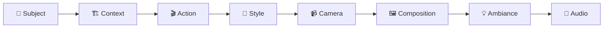

## 3. Professional Prompt Structure
<div align="center">

## 🎯 **PROFESSIONAL PROMPT STRUCTURE**

</div>

> **Master the 8-Component Framework** that transforms basic descriptions into cinematic masterpieces

### 🏆 **The Professional Formula**



### 📝 **Component Breakdown**

| Component | 🎯 Purpose | ✨ Example |
|-----------|---------|----------|
| **👤 Subject** | Main focus and character details | *"A confident 35-year-old CEO with short auburn hair"* |
| **🏗️ Context** | Scene setting and environment | *"in a modern glass-walled boardroom at sunset"* |
| **🎬 Action** | What's happening in the scene | *"she presents quarterly results with animated gestures"* |
| **🎨 Style** | Visual aesthetic and genre | *"cinematic corporate style with warm color grading"* |
| **📹 Camera** | Shot type and movement | *"smooth dolly-in from medium to close-up shot"* |
| **🖼️ Composition** | Framing and visual structure | *"rule of thirds, subject left-positioned, bokeh background"* |
| **💡 Ambiance** | Lighting, mood, and atmosphere | *"golden hour light through windows, professional warmth"* |
| **🎵 Audio** | Sound design and dialogue | *"she says: 'Our Q3 results exceeded all expectations'"* |

### 📊 **Quality Hierarchy**

```
🥇 MASTER LEVEL    = All 8 components + advanced techniques
🥈 PROFESSIONAL   = 6-8 components with detailed descriptions
🥉 INTERMEDIATE   = 4-6 components with basic details
⚠️  BASIC         = 1-3 components (poor results)
```

### 🔥 **Pro Tips for Each Component**

<details>
<summary><strong>👤 Subject Mastery</strong></summary>

- Include **15+ specific physical attributes**
- Specify age, ethnicity, build, facial features
- Detail clothing, accessories, and distinctive marks
- Add personality indicators through posture/expression

**Example**: *"Sarah Chen, a 32-year-old Asian-American woman with shoulder-length black hair in a professional bob, warm brown eyes behind wire-rimmed glasses, wearing a charcoal gray blazer over white collared shirt, confident posture with an approachable smile"*
</details>

<details>
<summary><strong>🏗️ Context Excellence</strong></summary>

- Describe location with architectural details
- Include props, furniture, and background elements
- Specify time of day and weather conditions
- Add environmental storytelling elements

**Example**: *"in a modern tech startup office with exposed brick walls, standing desks, multiple monitors, plants, and large windows showing a bustling city street at golden hour"*
</details>

<details>
<summary><strong>🎬 Action Precision</strong></summary>

- Use vivid, specific verbs
- Include micro-expressions and gestures
- Specify timing and sequence
- Add emotional undertones

**Example**: *"she gestures enthusiastically toward the presentation screen, pauses thoughtfully while reviewing data, then turns to the camera with a confident smile and slight head tilt"*
</details>

<div align="center">

